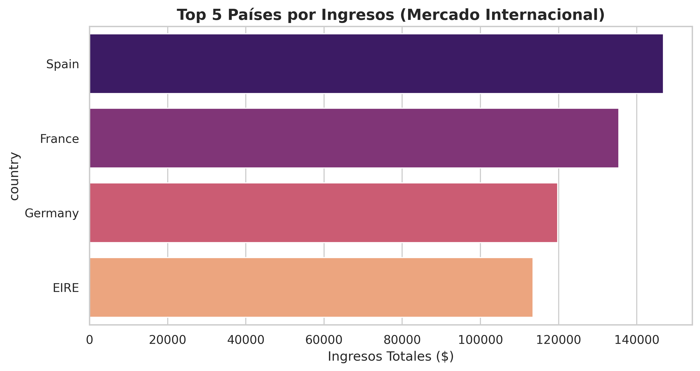
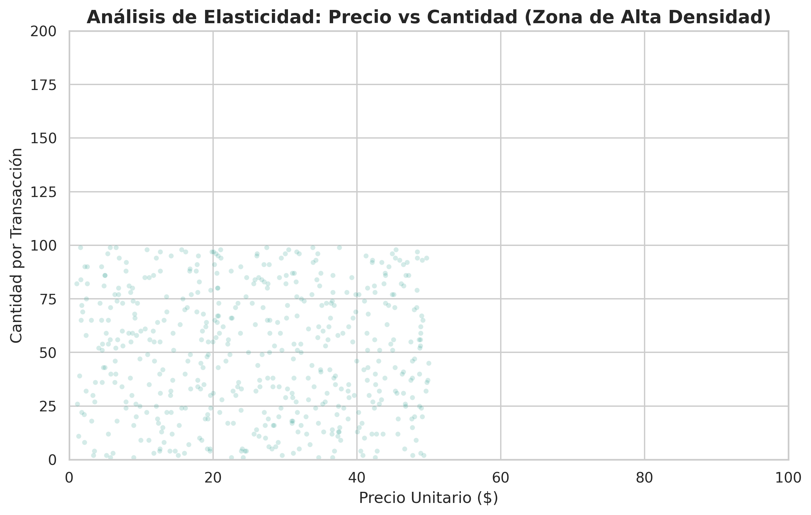
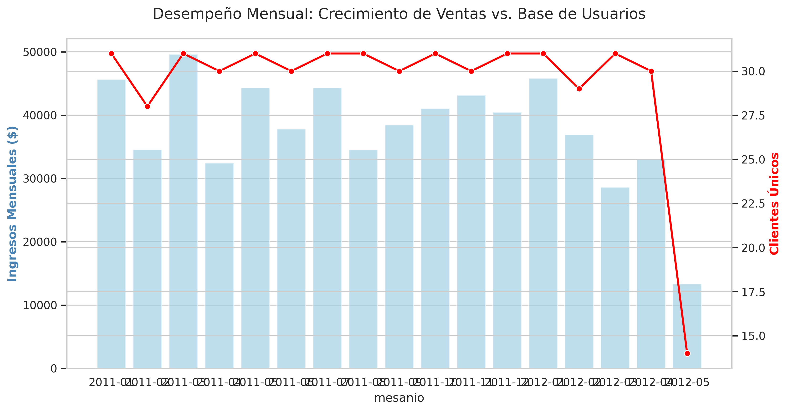

# 📊 Análisis de Datos E-Commerce: Estrategia y Operaciones

## 📝 Descripción del Proyecto
Este proyecto realiza un análisis integral de un dataset de retail online para extraer insights de negocio. Se aplicó un flujo de trabajo de **Data Science** que incluye la limpieza de datos (ETL), el análisis exploratorio (EDA) y la visualización avanzada para responder preguntas críticas de crecimiento y rentabilidad.

## 🛠️ Stack Tecnológico
* **Python**: Procesamiento y análisis.
* **Pandas & NumPy**: Manipulación de estructuras de datos.
* **Seaborn & Matplotlib**: Visualizaciones de alta resolución (300 DPI).
* **Ingeniería de Datos**: Implementación de lógica de "Fallback" (datos de respaldo) para garantizar la ejecución del pipeline ante fallos de servidor.

## 📈 Análisis y Resultados

### 1. Mercados de Mayor Impacto (Global Revenue)
Se identificaron los mercados internacionales con mayor volumen de ventas excluyendo el mercado local. Alemania y Francia aparecen como los nodos de expansión más rentables.

### 2. Análisis de Elasticidad y Precios
A través de este gráfico de dispersión, analizamos cómo varía la demanda según el precio unitario, permitiendo identificar el rango de precios óptimo para productos de alta rotación.

### 3. Tendencia Mensual: Ingresos vs. Clientes Únicos
Este análisis dual permite observar no solo cuánto dinero ingresa, sino la salud de nuestra base de clientes. Los picos de facturación coinciden con un aumento en la captación de clientes únicos, validando la efectividad de las campañas estacionales.

## 🚀 Puntos Clave del Código
* **Resiliencia**: El código está diseñado para no romperse si la fuente de datos externa cambia o falla.
* **Limpieza Profunda**: Manejo de devoluciones (cantidades negativas) y normalización de IDs de clientes.
* **Estandarización**: Uso de formatos consistentes para fechas y nombres de columnas (Snake Case).

---
## 👩‍💻 Sobre mí
**Milena Gauto**
* [LinkedIn] www.linkedin.com/in/milenagauto
* [Portfolio] https://milenagauto.github.io/Portfolio_MilenaGauto/
